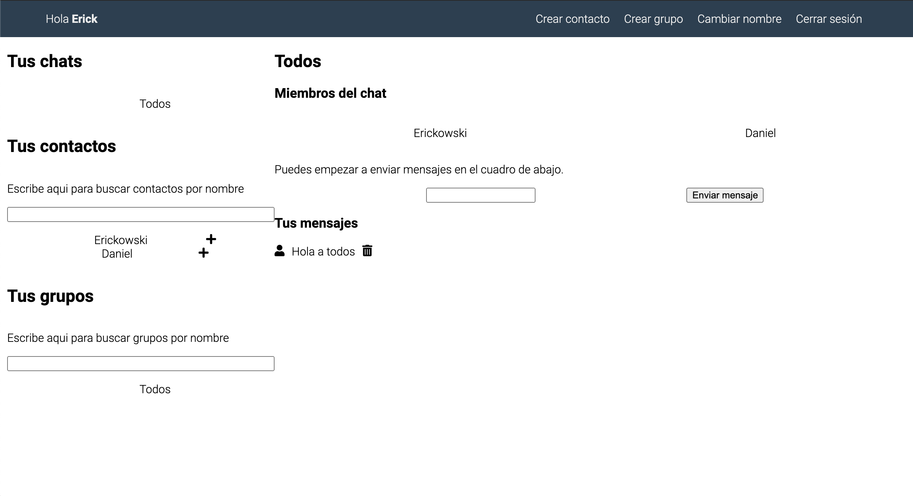

# 💻 Chat Anonimo

Chat anonimo es una aplicación donde puedes ingresar con un nombre de usuario, crear contactos, grupos. Puedes enviar mensajes y eliminarlos. También puedes cambiar tu nombre y buscar contactos o grupos por nombre.



## 🛠 Scripts

```bash
# Instalar dependencias
$ npm install

# Encender servidor de desarrollo en localhost:3000
$ npm run dev

# Crear version de producción
$ npm run build

```

## 💎 Tecnologías

-   ReactJS
-   React Hooks
-   Styled Components

## 💣 Despliegue

https://upbeat-sammet-ba96d0.netlify.app/
